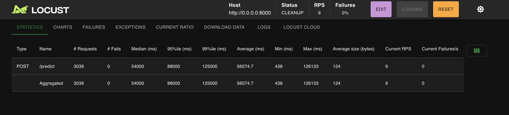

# 🎵 Surveillance Sound Classification API

A real-time audio classification system designed to detect and classify surveillance-related sounds such as gunshots, explosions, and emergency sirens. This project implements a machine learning model using YAMNet embeddings and provides both REST API and web interface for sound classification.

## 📺 Video Demo

YouTube Demo Link - [Video Demo](https://youtu.be/z1gbdaEpn98)

## 🌐 Live Applications

- **Backend API**: [Railway Deployment](https://surveillancemodelmlop-production.up.railway.app/docs)
- **Frontend UI**: [Hugging Face Spaces](https://huggingface.co/spaces/GaiusIrakiza/Sound-surveillance-Model)

## 🎯 Project Description

This project implements a **Sound Events for Surveillance Applications (SESA)** classification system that can identify four distinct types of audio:

- **0 - Casual** (non-threatening sounds, background noise)
- **1 - Gunshot** (firearms discharge)
- **2 - Explosion** (bombs, blasts)
- **3 - Siren** (emergency alarms, police/ambulance sirens)

### Key Features

- Real-time audio classification using YAMNet embeddings
- RESTful API with FastAPI
- Model versioning and retraining capabilities
- Web interface with Streamlit
- Load testing with Locust
- Docker containerization
- Comprehensive preprocessing pipeline with data augmentation

## 📊 Model Performance

The trained model achieves the following performance metrics:

```
              precision    recall  f1-score   support
      Casual       0.96      0.79      0.87        29
     Gunshot       0.90      0.86      0.88        21
   Explosion       0.88      0.97      0.93        39
 Siren/Alarm       0.89      1.00      0.94        16

    accuracy                           0.90       105
   macro avg       0.91      0.91      0.90       105
weighted avg       0.91      0.90      0.90       105
```

## 🚀 Quick Start

### Prerequisites

- Python 3.10+
- Docker (optional)
- 4GB+ RAM recommended

### Local Setup

1. **Clone the repository**

   ```bash
   git clone https://github.com/your-username/Surveillance_Model_MLOP.git
   cd Surveillance_Model_MLOP
   ```
2. **Create virtual environment**

   ```bash
   python -m venv venv
   source venv/bin/activate  # On Windows: venv\Scripts\activate
   ```
3. **Install dependencies**

   ```bash
   pip install -r requirements.txt
   pip install -r requirements-dev.txt  # For development tools
   ```
4. **Run the API server**

   ```bash
   uvicorn app.api:app --host 0.0.0.0 --port 8000 --reload
   ```
5. **Access the API**

   - API Documentation: http://localhost:8000/docs
   - Health Check: http://localhost:8000/health
   - Status: http://localhost:8000/status

### Docker Setup

1. **Build the Docker image**

   ```bash
   docker build -t surveillance-sound-api .
   ```
2. **Run the container**

   ```bash
   docker run -p 8000:8000 surveillance-sound-api
   ```

## 📁 Project Structure

```
Surveillance_Model_MLOP/
├── app/
│   └── api.py                 # FastAPI application
├── data/
│   ├── train_v1/             # Training audio files
│   ├── test/                 # Test audio files
│   └── SESA.txt             # Dataset description
├── models/
│   └── model_v1/
│       └── sesa_model_v1.keras  # Trained model file
├── src/
│   ├── model.py              # Model architecture and training
│   ├── preprocessing.py      # Audio preprocessing pipeline
│   └── prediction.py         # Prediction functions
├── notebook/
│   └── sound_surveillance.ipynb  # Jupyter notebook with analysis
├── streamlit_app/
│   └── ui.py                 # Streamlit web interface
├── requirements.txt          # Production dependencies
├── requirements-dev.txt      # Development dependencies
├── Dockerfile               # Docker configuration
├── locustfile.py           # Load testing configuration
└── README.md               # This file
```

## 🔧 API Endpoints

### Core Endpoints

| Endpoint     | Method | Description                 |
| ------------ | ------ | --------------------------- |
| `/`        | GET    | Root status check           |
| `/health`  | GET    | Health check                |
| `/status`  | GET    | API status with model info  |
| `/predict` | POST   | Classify audio file         |
| `/retrain` | POST   | Retrain model with new data |

### Example Usage

**Predict sound class:**

```bash
curl -X POST "http://localhost:8000/predict" \
     -H "accept: application/json" \
     -H "Content-Type: multipart/form-data" \
     -F "file=@data/test/casual_000.wav"
```

**Response:**

```json
{
  "class_id": 0,
  "label": "Casual",
  "confidence": 0.95,
  "model_version": "v1",
  "timestamp": "2024-01-15T10:30:00"
}
```

## 📓 Jupyter Notebook

The `notebook/sound_surveillance.ipynb` contains detailed analysis including:

### 1. Data Preprocessing

- Audio loading and resampling to 16kHz
- YAMNet embedding extraction (1024-dimensional features)
- Data augmentation techniques:
  - Noise addition
  - Pitch shifting
  - Time stretching
- Feature normalization and validation

### 2. Model Training

- Sequential neural network architecture
- Dense layers with batch normalization and dropout
- Early stopping and learning rate reduction
- Model checkpointing for best weights

### 3. Model Evaluation

- Classification report with precision, recall, F1-score
- Confusion matrix visualization
- Per-class performance analysis

### 4. Prediction Functions

- Single file prediction
- Confidence scoring
- Error handling and validation

## 🧠 Model Architecture

The model uses a **Sequential Neural Network** with the following architecture:

```
Input (1024,) → Dense(512) → BatchNorm → ReLU → Dropout(0.5)
              → Dense(256) → ReLU → Dropout(0.3)
              → Dense(128) → ReLU → Dropout(0.2)
              → Dense(64) → ReLU → Dropout(0.1)
              → Dense(32) → ReLU → Dropout(0.1)
              → Dense(4) → Softmax
```

**Key Features:**

- **Input**: 1024-dimensional YAMNet embeddings
- **Optimizer**: Adam with learning rate scheduling
- **Loss**: Sparse categorical crossentropy
- **Regularization**: Dropout layers and batch normalization
- **Output**: 4-class probability distribution

## 📊 Load Testing Results

Run load testing with Locust:

```bash
locust -f locustfile.py --host=http://localhost:8000
```

### 🎯 **Test Configuration:**

- **Users**: 500 concurrent users
- **Ramp-up**: 10 seconds (50 users/second)
- **Test Duration**: 400 seconds
- **Endpoint**: `/predict` with audio file upload

### 📈 **Actual Performance Results:**



**Key Metrics from Load Test:**

- **Total Requests**: 3,039
- **Success Rate**: 100% (0 failures)
- **Current RPS**: 9 requests/second
- **Average Response Time**: 56.1 seconds
- **Median Response Time**: 54 seconds
- **95th Percentile**: 88 seconds
- **99th Percentile**: 125 seconds
- **Min Response Time**: 438ms
- **Max Response Time**: 126.1 seconds

### ⚠️ **Performance Analysis:**

**Strengths:**

- ✅ **Zero failures** - System is stable under load
- ✅ **Consistent throughput** - 9 RPS maintained
- ✅ **No errors** - API handles requests reliably

**Areas for Improvement:**

- ⚠️ **High response times** - Average 56 seconds is too slow
- ⚠️ **Large variance** - Response times range from 438ms to 126 seconds
- ⚠️ **ML inference bottleneck** - Audio processing is CPU-intensive

### 🔧 **Optimization Recommendations:**

1. **Model Optimization:**

   - Consider model quantization for faster inference
   - Implement model caching for repeated predictions
   - Use GPU acceleration if available
2. **API Improvements:**

   - Add request queuing for better resource management
   - Implement async processing for audio files
   - Add response caching for similar audio inputs
3. **Infrastructure:**

   - Scale horizontally with multiple API instances
   - Use load balancers for better distribution
   - Optimize server resources (CPU, RAM)

### 📊 **Target Performance Goals:**

- **Response Time**: <5 seconds average
- **RPS**: 20+ requests/second
- **Error Rate**: <1%
- **Consistency**: <2x variance in response times

## 🎵 Audio Specifications

- **Format**: WAV files only
- **Channels**: Mono
- **Sampling Rate**: 16 kHz
- **Bit Depth**: 16-bit
- **Duration**: Up to 33 seconds per clip
- **Max File Size**: 100MB per file

## 🔄 Model Retraining

The API supports incremental model retraining:

```bash
curl -X POST "http://localhost:8000/retrain" \
     -H "accept: application/json" \
     -H "Content-Type: multipart/form-data" \
     -F "files=@new_audio_1.wav" \
     -F "files=@new_audio_2.wav"
```

**Features:**

- Automatic model versioning
- Incremental learning from previous model
- Data augmentation during training
- Validation and checkpointing

## 🛠️ Development

### Running Tests

```bash
# Load testing
locust -f locustfile.py --host=http://localhost:8000

# Streamlit interface
streamlit run streamlit_app/ui.py
```

### Code Quality

- Type hints throughout the codebase
- Comprehensive logging
- Error handling and validation
- Modular architecture

## 📦 Model Files

The trained model is saved as a **Keras (.keras) file**:

- **Location**: `models/model_v1/sesa_model_v1.keras`
- **Size**: ~2MB
- **Format**: TensorFlow/Keras SavedModel
- **Compatibility**: TensorFlow 2.x

## 🚀 Deployment

### Railway Deployment

1. Connect your GitHub repository to Railway
2. Set environment variables if needed
3. Deploy automatically on push to main branch

### Hugging Face Spaces

1. Create a new Space with Streamlit
2. Upload the `streamlit_app/ui.py` file
3. Configure requirements and dependencies

### Local Production

```bash
# Using Gunicorn
pip install gunicorn
gunicorn app.api:app -w 4 -k uvicorn.workers.UvicornWorker --bind 0.0.0.0:8000
```

## 🤝 Contributing

1. Fork the repository
2. Create a feature branch
3. Make your changes
4. Add tests if applicable
5. Submit a pull request

## 🙏 Acknowledgments

- **Dataset**: SESA (Sound Events for Surveillance Applications)
- **Embeddings**: YAMNet by Google Research
- **Framework**: FastAPI, TensorFlow, Streamlit
- **Author**: Tito Spadini

## 📞 Support

For questions or issues:

- Create an issue on GitHub
- Contact: g.irakiza@alustudent.com
- Documentation: [API Docs](https://surveillancemodelmlop-production.up.railway.app/docs)

---

**Note**: This system is designed for educational and research purposes. For production surveillance applications, ensure compliance with local laws and regulations.
